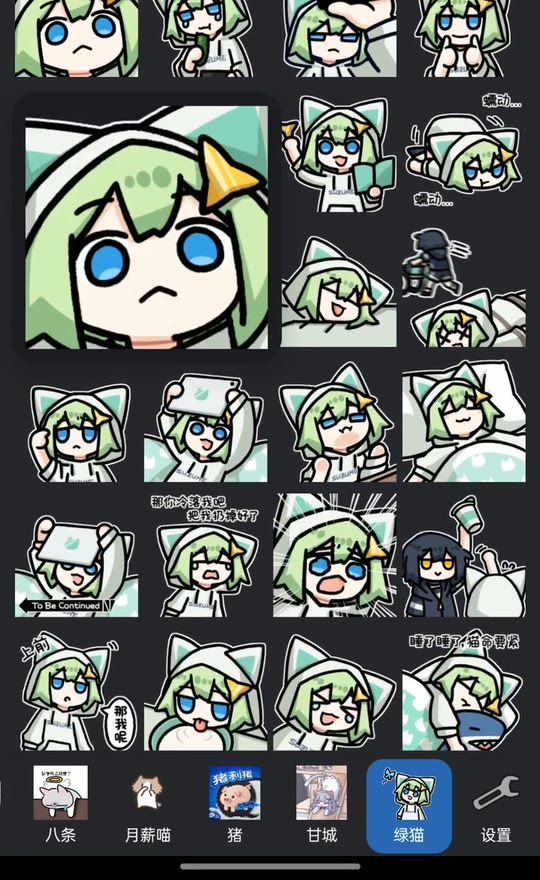
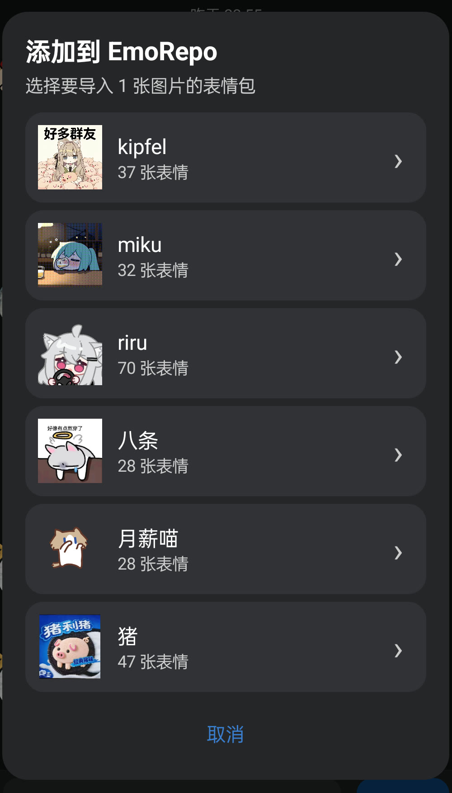
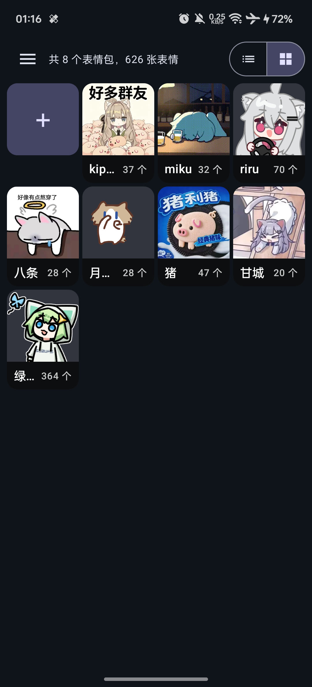

# EmoRepo 表情仓

EmoRepo 是一个以跨端同步为目标的表情仓库：表情、分组和顺序保存在你自己的 Git 仓库中，不再只属于某一台手机或某一个 App。当前提供 Android 管理 App 和 QQ 适配，未来其他平台只要实现同一套文件协议，也可以使用同一个表情仓库。

如果你使用过 QAuxiliary 的“本地表情”，EmoRepo 解决的是相近的使用场景：都能在 QQ 中浏览和发送自己的表情。不同之处在于，QAuxiliary“本地表情”是 QAuxiliary 内部面向当前 QQ 环境的功能；EmoRepo 则是独立的仓库管理器和 LSPosed 模块，以 Git 仓库作为唯一数据源，重点解决多设备和跨平台同步。

EmoRepo 不依赖 QAuxiliary，也不会读取或复用 QAuxiliary“本地表情”的数据、设置和缓存。两者可以同时安装，但各自管理独立的数据；QQ 表情按钮的长按入口最终由后生效的模块处理。

## 功能

- 管理表情包、封面和顺序，批量导入、删除、移动表情。
- 静态图和 GIF 均可预览；大图支持左右翻页、缩放、导出和转发。
- 使用 HTTPS Git 仓库自动同步表情、顺序和各设备的最近使用记录。
- 长按 QQ 的表情按钮打开独立底部抽屉，短按仍使用 QQ 原面板。
- QQ 面板支持最近使用、左右切包、上滑展开、GIF 播放和按住预览。
- 长按 QQ 图片消息，可通过“添加到 EmoRepo”批量导入并二次确认。
- QQ 面板每行可设置 3–8 个表情，并使用内存和磁盘缓存减少重复加载。

## 界面预览

主要使用入口位于 QQ：长按输入栏表情按钮打开 EmoRepo 面板，长按聊天图片则可以选择带封面的目标表情包并导入。App 负责表情包管理、排序和同步设置。

| QQ 表情面板 | QQ 图片导入 | App 表情包管理 |
|:---:|:---:|:---:|
|  |  |  |

## 使用条件

- Android 7.0 或更高版本。
- Android QQ；暂不支持 TIM、QQ 国际版或微信。
- 如果需要 QQ 内功能，设备需要可用的 LSPosed 环境。
- 一个可通过 HTTPS 克隆和推送的 EmoRepo 表情 Git 仓库。私有仓库需要提供有读写权限的 Token；当前版本不支持 SSH。

目前主要在 QQ `9.1.70` 上完成真机验证。QQ 更新内部实现后，个别 Hook 功能可能需要后续适配。

## 下载与安装

1. 从 [Releases](https://github.com/4o4E/EmoRepo/releases/latest) 下载最新 APK。不确定设备 ABI 时选择 `universal`，多数新手机也可选择 `arm64-v8a`。
2. 安装 APK，在 LSPosed 中启用“表情仓”，作用域只勾选 QQ。
3. 打开表情仓，按首次引导填写仓库 HTTPS 地址、Git 身份和设备 ID，然后完成克隆。公开仓库可以不填 Token。
4. 强制停止并重新打开 QQ，使 LSPosed 模块和最新配置生效。

仓库当前为 Private，因此下载页面暂时需要具有仓库访问权限的 GitHub 账号。

## 在 App 中使用

- “表情列表”用于查看表情包；点击表情包进入四列网格。
- 长按表情包进入排序模式，拖动后点击“完成”才会保存新顺序。
- “添加表情”可新建表情包，或选择目标包后从系统文件选择器批量导入。
- 表情包内先进入多选模式，再批量删除或移动；普通滚动不会触发拖选。
- 点击表情打开全屏预览；长按预览可导出原文件或调用系统分享。
- “软件设置”可调整同步、设备最近记录数和 QQ 面板列数等实际生效的选项。

## 在 QQ 中使用

- 短按 QQ 输入栏的表情按钮：继续打开 QQ 原生面板。
- 长按表情按钮：打开 EmoRepo 抽屉；向上翻找时自动展开，向下拖动可收起或关闭。
- 点击表情：立即关闭面板并发送到当前会话。
- 按住表情：在手指附近显示预览；滑到其他表情会切换预览，松手立即关闭，不会发送。
- 左右滑动切换表情包；底部第一项固定为“最近使用”，末尾齿轮可跳转表情仓设置。
- 长按 QQ 中的图片消息并选择“添加到 EmoRepo”，选择目标表情包并确认后完成导入。

## 数据与隐私

- 表情仓库保存在 EmoRepo 的 App 私有目录，QQ 只能通过受控接口读取或写入明确的数据。
- Git Token 使用 Android Keystore 保护，界面不会回显已经保存的 Token。
- 同步目标仅为你在引导中填写的 Git 远端；日志会隐藏 URL 中的账号、Token 和查询参数。
- 表情和 GIF 始终以原文件发送；缩略图只是可删除、可重新生成的本地缓存，不写入表情仓库。

## 常见问题

### 长按 QQ 表情按钮没有反应

确认 LSPosed 中已经启用表情仓并勾选 QQ，然后强制停止并重启 QQ。还应先在表情仓中完成仓库配置。

如果同时启用了其他模块的表情面板，多个模块可能设置同一个 QQ 长按监听；最终只会打开最后生效的一个面板，不会同时叠出两个。按需要关闭其中一个即可。

### 为什么必须准备 Git 仓库？

EmoRepo 把 Git 仓库作为可迁移、可审计的表情数据源，用它同步表情包、顺序和最近使用记录。当前版本不提供只保存在手机上的空仓库初始化流程。

## 开发与构建

项目使用 Kotlin、Jetpack Compose、Gradle Kotlin DSL 和 JGit。开发需要 JDK 17 与 Android SDK：

```powershell
$env:JAVA_HOME='<JDK 17 installation directory>'
$env:ANDROID_HOME='<Android SDK installation directory>'
$env:ANDROID_SDK_ROOT=$env:ANDROID_HOME

.\gradlew.bat testDebugUnitTest lintDebug assembleDebug
```

Debug APK 按 ABI 输出到 `app\build\outputs\apk\debug\`，包括 `app-arm64-v8a-debug.apk` 和 `app-universal-debug.apk`。

设计、协议、验证状态和贡献前需要遵循的行为约束，请从 [`docs/README.md`](docs/README.md) 开始阅读。

## 许可证

[Apache License 2.0](LICENSE)
